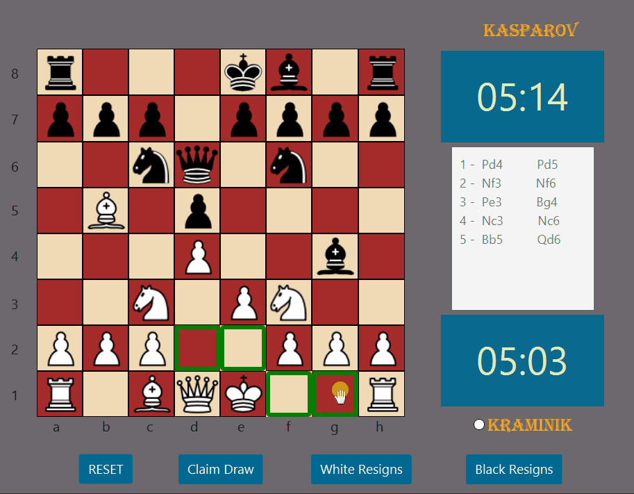
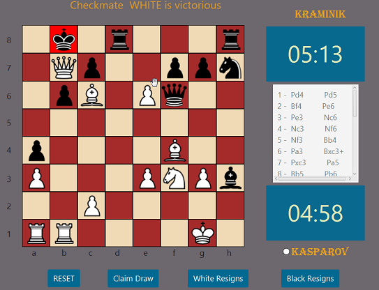

# Chess App
> 2 player Full Chess Game with GUI (JavaFx) based on MVC pattern implemented from scratch.


# Table of Contents

- [Features](#Features)
- [Demo](#Demo)
- [Technologies](#Technologies)
- [Install](#Install)
- [Run](#Run)

# Features

This is a complete Chess game written in Java with GUI ; It has been tested by playing tons of games and it works very well.

**It strictly follows the Chess rules according to this [handbook](https://www.fide.com/FIDE/handbook/LawsOfChess.pdf) made by FIDE for chess Laws  and have the following features:**
1. Regular moves and captures of Pawn, Bishop, Rook, Knight, Queen and King.
2. Moves like En Passant, Castling (Queen and King Side) and Pawn promotion.
3. Highlighting possible moves (any illegal moves according to the rules are excluded) when any piece is clicked which assist beginner players to know which to play.
4. Disallowing any illegal moves ( ex. moving pinned pieces, illegal castling, moving kings to attacked cells)
5. All game states (Check , CheckMate, StaleMate and TimeOut) are included in the game logic

**GUI features**
1. Chess Clock (Custom minutes per side and Increment in seconds)
2. Move Logger following the chess moves' notations rules
3. Buttons for claiming Draw and Resignations.

# Demo
**- This is a Demo of two players playing a timed game**



**- Picture showing checkmate state.**



# Technologies
- Maven
- JavaFX
- JUnit5
- MySQL
- H2 DB Engine
- JPA
- Log4J
- Lombok
- JavaDoc Plugin
- Checkstyle Plugin
- MVC

# Install

 run the following commands:
```bash
git clone https://github.com/ahmedelahwany/Full-Chess-Game.git
cd Full-Chess-Game
mvn install
```

# Run
run the following commands in the project directory
```bash
mvn package
java -jar ./target/Full-Chess-Game-1.0.jar
```

## License

- Copyright 2021 © <a href="https://github.com/ahmedelahwany" target="_blank">Ahmed Elahwany</a>.